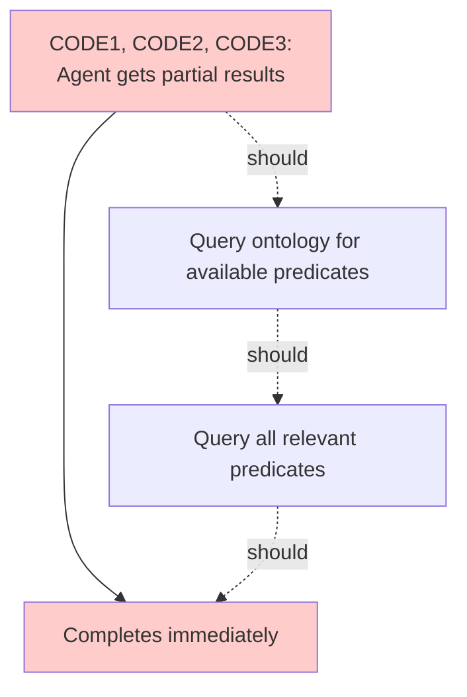
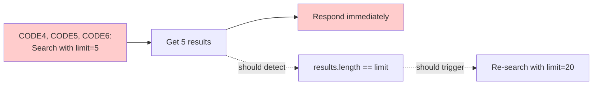

# Axial Coding: Agent Error Patterns

## Objective

Group agent errors into categories that reveal systemic issues in agent
behavior.

## Prerequisites

**Required Input:** `SCRATCHPAD1.md` from Open Coding stage **Previous Stage:**
Open Coding (`open-coding.prompt.md`)

## Process

1. Read all codes from `SCRATCHPAD1.md`
2. Identify patterns and relationships between errors
3. Document error categories in `SCRATCHPAD2.md`
4. **Next Step:** Proceed to `selective-coding.prompt.md` after categorizing all
   codes

## Output

**File:** `SCRATCHPAD2.md` **Next Stage:** Selective Coding
(`selective-coding.prompt.md`)

## Category Structure

Each category must follow this format with systematic reference labels:

````markdown
## CAT1: descriptive_category_name

**Label:** `CAT1`

**Codes:** `CODE1`, `CODE2`, `CODE3` (from SCRATCHPAD1.md)

**Pattern:** <how these errors relate to each other>

**Agent Issue:** <what systemic agent problem causes these errors>

```mermaid
<diagram showing error relationships using code labels>
```
````

**Label Assignment Rules:**

- Number categories sequentially starting from `CAT1`
- Use format `CAT1`, `CAT2`, `CAT3`, etc.
- Include the label in both the heading and the **Label:** field
- Reference codes using their labels (e.g., `CODE1`, `CODE2`) in the **Codes:**
  field
- Use code labels in mermaid diagrams for clear traceability
- Labels must be unique and sequential across all categories in the document

## Categorization Rules

**Focus on agent improvement implications:**

- Group errors that indicate the same underlying agent logic problem
- Identify when errors cascade (one error causes another)
- Show which errors occur together in scenarios
- Highlight gaps in agent tool-use strategy

**Avoid:**

- Generic behavioral descriptions without improvement implications
- Categories that don't map to agent logic problems
- LLM capability theorizing without actionable insights
- Mixed categories combining unrelated error types

## Examples

Example 1:

````markdown
## CAT1: Incomplete Data Exploration

**Label:** `CAT1`

**Codes:** `CODE1`, `CODE2`, `CODE3`

**Pattern:** Agent queries one or two predicates, gets partial results, then
immediately generates response without exploring other available predicates that
could provide more complete information.

**Agent Issue:** Agent lacks systematic strategy for exploring graph schema.
Should query ontology first, identify all relevant predicates for the subject
type, then query each before responding.


````

Example 2:

````markdown
## CAT2: Search Result Truncation

**Label:** `CAT2`

**Codes:** `CODE4`, `CODE5`, `CODE6`

**Pattern:** Agent sets search parameters that artificially limit results (low
threshold, low limit), retrieves exactly limit number of results indicating
truncation, then responds without adjusting parameters to check for additional
relevant content.

**Agent Issue:** Agent should detect when search hits limit boundary and perform
follow-up search with adjusted parameters. Needs logic: if results.length ==
limit, increase limit and re-search.


````
