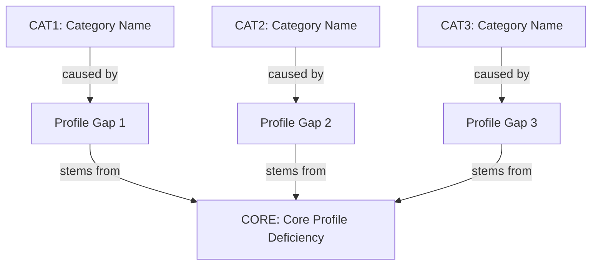

# Selective Coding: Agent Profile Improvement Roadmap

## Objective

Identify the core profile deficiency that explains all error categories and
produce specific agent profile changes to address them.

## Prerequisites

**Required Input:** `SCRATCHPAD2.md` from Axial Coding stage **Previous Stage:**
Axial Coding (`axial-coding.prompt.md`)

## Process

1. Read all categories from `SCRATCHPAD2.md`
2. Identify the core profile deficiency that unifies all categories
3. Document specific profile improvements in `SCRATCHPAD3.md`
4. Each improvement must specify exact text to add/modify in agent profiles

## Output

**File:** `SCRATCHPAD3.md` **Deliverable:** Actionable profile improvement
roadmap with specific text changes

## Analysis Structure

````markdown
## CORE: primary_profile_deficiency

**Label:** `CORE`

**Definition:** <one sentence describing the fundamental profile gap>

**Evidence:** All error categories trace to profile instructions that are
missing, ambiguous, or incomplete:

- **CAT1:** <Brief summary of profile gap from this category>
- **CAT2:** <Brief summary of profile gap from this category>
- **CAT3:** <Brief summary of profile gap from this category>

**Profile Improvement Strategy:** <what type of profile changes are needed>

### Theory: Category-to-Profile-Gap Relationship



## PROFILE IMPROVEMENT ROADMAP

### PRIO1: <most critical profile change>

**Label:** `PRIO1`

**Addresses Categories:** `CAT1`, `CAT2` (from SCRATCHPAD2.md)

**Target Profile:** `<agent_name>` (`config/agents/<agent_name>.agent.md`)

**Target Section:** <which section to modify>

**Current Text:**

> <quote existing profile text, or "Section does not exist">

**Proposed Text:**

> <exact text to replace or add to the profile>

**Expected Impact:**

- `scenario_name`: <specific improvement>
- `scenario_name`: <specific improvement>

### PRIO2: <second most critical profile change>

**Label:** `PRIO2`

**Addresses Categories:** `CAT3`, `CAT4`

**Target Profile:** `<agent_name>`

**Target Section:** <which section to modify>

**Current Text:**

> <quote existing profile text>

**Proposed Text:**

> <exact text to replace or add>

**Expected Impact:**

- `scenario_name`: <specific improvement>
- `scenario_name`: <specific improvement>
````

**Label Assignment Rules:**

- Number priorities sequentially starting from `PRIO1`
- Use format `PRIO1`, `PRIO2`, `PRIO3`, etc.
- Include the label in both the heading and the **Label:** field
- Reference categories using their labels (e.g., `CAT1`, `CAT2`) in the
  **Addresses Categories:** field
- Use priority labels in solution architecture diagram
- Always include **Target Profile:** and **Target Section:** fields
- Labels must be unique and sequential across all priorities in the document

## Analysis Rules

**Focus on profile text changes:**

- Each priority must propose specific text to add or modify in a profile
- Proposed text must be complete and ready to insert
- Changes must address the profile gaps identified in categories
- Expected impact must reference specific evaluation scenarios

**Avoid:**

- LLM non-determinism as root cause attribution
- Code changes to agent implementation (focus on profile text only)
- Generic recommendations without specific proposed text
- Theoretical frameworks without actionable profile edits
- Effort or timeline estimations

## Example

````markdown
## CORE: Incomplete Workflow Specifications in Agent Profiles

**Label:** `CORE`

**Definition:** Agent profiles describe desired outcomes but lack explicit
step-by-step workflows with decision criteria, allowing agents to skip steps or
make premature decisions.

**Evidence:** All error categories trace to profile instructions that are
missing, ambiguous, or incomplete:

- **CAT1 (Incomplete Data Exploration):** Profile says "use wildcard queries"
  but doesn't mandate this as step 1 of every workflow
- **CAT2 (Search Result Truncation):** Profile says "adjust parameters if
  incomplete" but doesn't define what "incomplete" means
- **CAT3 (Response Content Not Backed by Retrieval):** Profile says "report
  findings" but doesn't explicitly forbid adding unretrieved information

**Profile Improvement Strategy:** Add explicit numbered workflows with mandatory
steps and clear decision criteria to each agent profile.

### Theory: Category-to-Profile-Gap Relationship

```mermaid
graph TB
    %% Error Categories
    CAT1[CAT1: Incomplete Data<br/>Exploration]
    CAT2[CAT2: Search Result<br/>Truncation]
    CAT3[CAT3: Response Content Not<br/>Backed by Retrieval]

    %% Profile Gaps
    GAP1[graph_navigator: Missing<br/>mandatory schema discovery step]
    GAP2[content_searcher: Missing<br/>definition of "incomplete"]
    GAP3[detailed_reporter: Missing<br/>explicit "no hallucination" rule]

    %% Core Deficiency
    CORE[CORE: Incomplete Workflow<br/>Specifications]

    %% Relationships
    CAT1 -->|caused by| GAP1
    CAT2 -->|caused by| GAP2
    CAT3 -->|caused by| GAP3

    GAP1 -->|stems from| CORE
    GAP2 -->|stems from| CORE
    GAP3 -->|stems from| CORE
```

## PROFILE IMPROVEMENT ROADMAP

### PRIO1: Mandatory Schema Discovery Workflow

**Label:** `PRIO1`

**Addresses Categories:** `CAT1`

**Target Profile:** `graph_navigator` (`config/agents/graph_navigator.agent.md`)

**Target Section:** "Query Strategy" (or create new "Mandatory Workflow"
section)

**Current Text:**

> Use wildcard queries to discover all predicates connecting these entities.
> Check for indirect connections via shared intermediate entities.

**Proposed Text:**

> ## Mandatory Query Workflow
>
> **CRITICAL:** Complete ALL steps before generating a response.
>
> 1. **Schema Discovery (REQUIRED FIRST STEP)**
>    - Call `get_ontology` to retrieve available predicates
>    - Identify all predicates relevant to the user's query
>    - Do NOT skip this step even if you think you know the predicates
> 2. **Exhaustive Querying**
>    - Query EACH relevant predicate identified in step 1
>    - Use wildcard queries (`subject ? ?`) to discover unexpected relationships
>    - Check indirect connections via intermediate entities
> 3. **Completeness Verification**
>    - Confirm all relevant predicates have been queried
>    - If any predicate was skipped, query it before proceeding
> 4. **Response Generation**
>    - Only after steps 1-3 are complete, generate response
>    - Include ONLY information from tool responses

**Expected Impact:**

- `search_drug_discovery_platform`: Will retrieve all capabilities, not just
  first found
- `traverse_platform_dependencies`: Will discover all relationship types
- `recall_drug_discovery_team`: Will find all team members and contributors

### PRIO2: Search Completeness Criteria

**Label:** `PRIO2`

**Addresses Categories:** `CAT2`

**Target Profile:** `content_searcher`
(`config/agents/content_searcher.agent.md`)

**Target Section:** "Search Strategy"

**Current Text:**

> If results seem incomplete, perform follow-up searches with adjusted
> parameters.

**Proposed Text:**

> ## Search Completeness Rules
>
> **Definition of Incomplete Results:** Results are incomplete if
> `results.length == limit`. This indicates potential truncation—more relevant
> content may exist.
>
> **Mandatory Follow-up Search:** If `results.length == limit`:
>
> 1. Double the limit parameter
> 2. Perform a follow-up search
> 3. Repeat until `results.length < limit` or limit reaches 100
>
> **Never respond based on truncated results without follow-up search.**

**Expected Impact:**

- `search_biomarker_trials`: Will retrieve all relevant trials
- `search_gmp_compliance`: Will find all compliance documents
- `search_multi_drug_comparison`: Will get complete drug information

### PRIO3: Explicit No-Hallucination Rule

**Label:** `PRIO3`

**Addresses Categories:** `CAT3`

**Target Profile:** `detailed_reporter`
(`config/agents/detailed_reporter.agent.md`)

**Target Section:** "Formatting Guidelines" (add new subsection)

**Current Text:**

> Preserve all raw data and evidence. Your role is reporting and synthesis, not
> primary research.

**Proposed Text:**

> ## Response Content Rules
>
> **CRITICAL: No Hallucination Policy**
>
> - Include ONLY information that appears in tool call responses
> - NEVER add facts, numbers, names, or relationships from your training data
> - If information is missing, state "Information not found" rather than
>   inferring
> - Every claim in your response must trace to a specific tool response
>
> **Before finalizing response, verify:**
>
> - [ ] Every fact appears in a tool response
> - [ ] No information was added from general knowledge
> - [ ] Missing information is explicitly acknowledged

**Expected Impact:**

- All scenarios: Responses will match retrieved data exactly
- Eliminates hallucinated dependencies, capabilities, relationships
````
