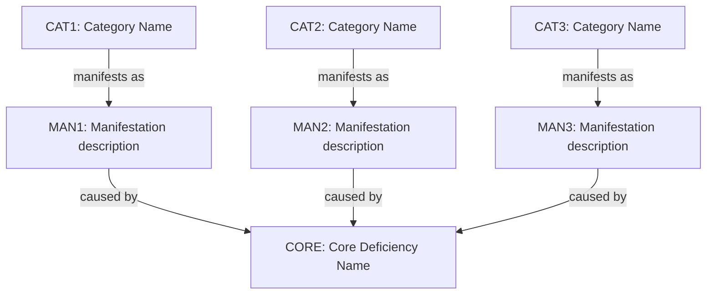
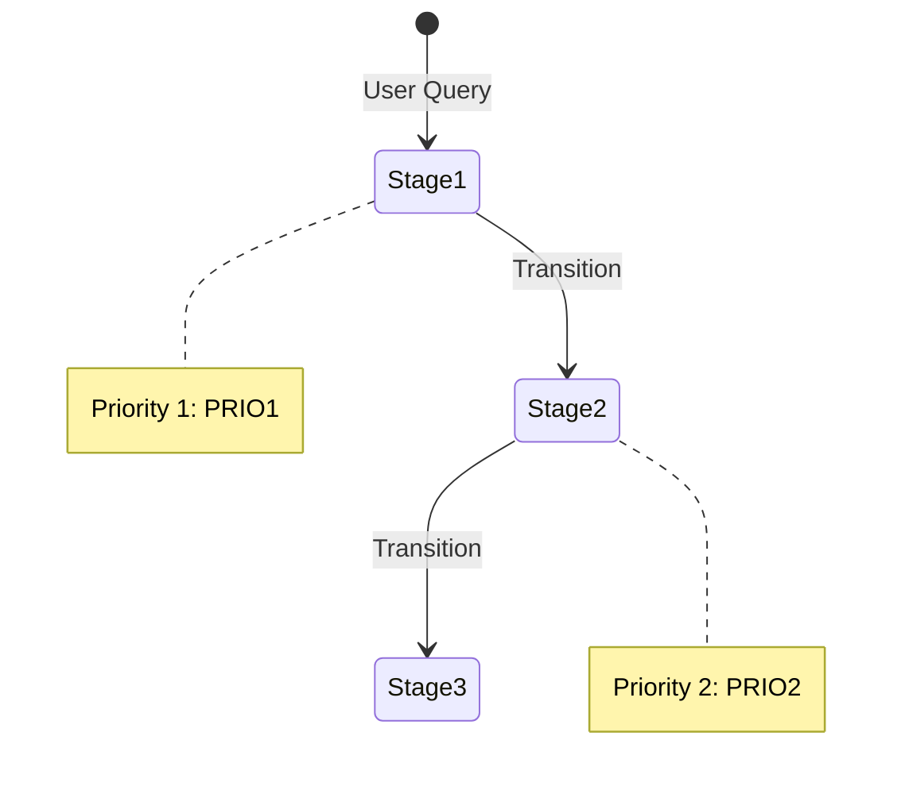
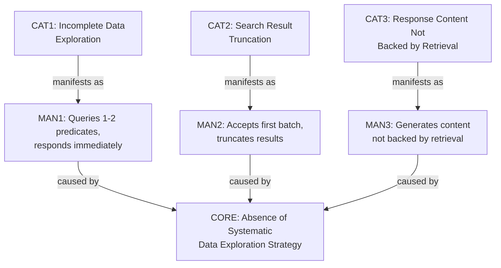
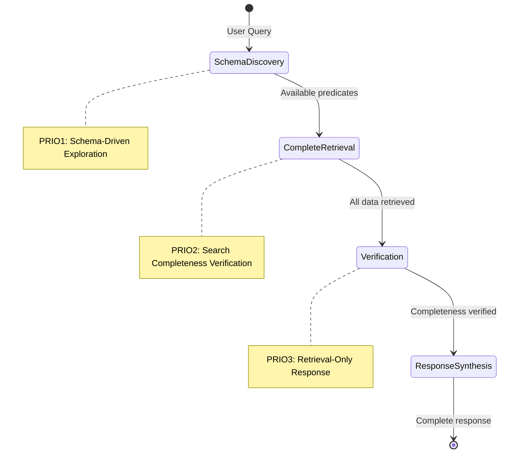

# Selective Coding: Core Agent Deficiency

## Objective

Identify the fundamental agent deficiency that explains all error categories and
provides focus for agent improvement.

## Prerequisites

**Required Input:** `SCRATCHPAD2.md` from Axial Coding stage **Previous Stage:**
Axial Coding (`axial-coding.prompt.md`)

## Process

1. Read all categories from `SCRATCHPAD2.md`
2. Identify the core agent deficiency that unifies all categories
3. Document the core deficiency and improvement priorities in `SCRATCHPAD3.md`

## Output

**File:** `SCRATCHPAD3.md` **Deliverable:** Actionable improvement roadmap for
agent implementation

## Analysis Structure

````markdown
## CORE: primary_agent_problem

**Label:** `CORE`

**Definition:** <one sentence describing the fundamental agent problem>

**Evidence:** All error categories trace to agent making premature decisions
without complete data:

- **CAT1:** <Brief summary referencing category label>
- **CAT2:** <Brief summary referencing category label>
- **CAT3:** <Brief summary referencing category label>

**Agent Improvement Priority:** <what agent capability needs to be added/fixed>

### Theory: Category-to-Core-Deficiency Relationship



### Solution Architecture: Multi-Stage Retrieval Protocol



## IMPROVEMENT ROADMAP

### PRIO1: <most critical capability to add>

**Label:** `PRIO1`

**Addresses Categories:** `CAT1`, `CAT2` (from SCRATCHPAD2.md)

**Required Change:** <specific agent logic change needed>

**Expected Impact:**

- `scenario_name`: <specific improvement>
- `scenario_name`: <specific improvement>

### PRIO2: <second most critical capability>

**Label:** `PRIO2`

**Addresses Categories:** `CAT3`, `CAT4`

**Required Change:** <specific agent logic change needed>

**Expected Impact:**

- `scenario_name`: <specific improvement>
- `scenario_name`: <specific improvement>
````

**Label Assignment Rules:**

- Number priorities sequentially starting from `PRIO1`
- Use format `PRIO1`, `PRIO2`, `PRIO3`, etc.
- Include the label in both the heading and the **Label:** field
- Reference categories using their labels (e.g., `CAT1`, `CAT2`) in the
  **Addresses Categories:** field
- Use priority labels in solution architecture diagram
- Always include **Implementation Location:** field with specific file path
- Labels must be unique and sequential across all priorities in the document

## Analysis Rules

**Focus on actionable improvements:**

- Core deficiency must be solvable through agent logic changes
- Priorities must map directly to code changes in agent implementation
- Expected impact must reference specific evaluation scenarios

**Avoid:**

- LLM non-determinism as root cause attribution
- Problems unsolvable in agent code
- Generic recommendations without implementation guidance
- Theoretical frameworks without actionable priorities
- Effort or timeline estimations

## Example

````markdown
## CORE: Absence of Systematic Data Exploration Strategy

**Label:** `CORE`

**Definition:** Agent lacks systematic logic for exhaustively exploring
available data before responding, leading to incomplete retrieval and responses
based on partial information.

**Evidence:** All error categories trace to agent making premature decisions:

- **CAT1 (Incomplete Data Exploration):** Agent queries 1-2 predicates then
  stops, missing other relevant predicates
- **CAT2 (Search Result Truncation):** Agent accepts first batch of results
  without checking if more exist
- **CAT3 (Response Content Not Backed by Retrieval):** Agent generates content
  instead of retrieving, because it didn't exhaust retrieval options

**Agent Improvement Priority:** Implement multi-stage data exploration protocol:
(1) discover available data schema, (2) retrieve all relevant data, (3) verify
completeness, (4) then respond.

### Theory: Category-to-Core-Deficiency Relationship



### Solution Architecture: Multi-Stage Retrieval Protocol



## IMPROVEMENT ROADMAP

### PRIO1: Schema-Driven Graph Exploration

**Label:** `PRIO1`

**Addresses Categories:** `CAT1`

**Required Change:** Before querying specific predicates, agent must:

1. Call `get_ontology` to understand available predicates for entity type
2. Identify all predicates relevant to user query
3. Query each relevant predicate before responding
4. Track which predicates have been queried to ensure completeness

**Implementation Location:** `packages/libagent/orchestrator.js` - add pre-query
planning phase

**Expected Impact:**

- `search_drug_discovery_platform`: Will retrieve dependencies and capabilities
- `traverse_platform_dependencies`: Will find all relationship types
- `recall_drug_discovery_team`: Will explore all member/contributor predicates

### PRIO2: Search Completeness Verification

**Label:** `PRIO2`

**Addresses Categories:** `CAT2`

**Required Change:** After vector search, agent must:

1. Check if `results.length == limit`
2. If true, double limit and re-search to verify no relevant results were
   truncated
3. Continue until `results.length < limit` or reasonable maximum (e.g., 100)

**Implementation Location:** `packages/libagent/tools/search.js` - add
post-search verification

**Expected Impact:**

- `search_biomarker_trials`: Will retrieve all relevant trials, not just first 5
- `search_gmp_compliance`: Will find all compliance documents
- `search_multi_drug_comparison`: Will get complete drug information

### PRIO3: Retrieval-Only Response Generation

**Label:** `PRIO3`

**Addresses Categories:** `CAT3`

**Required Change:** Strengthen system prompt and tool response handling:

1. System prompt: "Generate responses ONLY from tool call results. Never add
   information from your training data."
2. Tool response format: Include explicit "ONLY USE THIS DATA" marker
3. Response verification: Agent checks that all facts in response appear in tool
   results

**Implementation Location:** `packages/libagent/prompts/system.js` and response
generation logic

**Expected Impact:**

- All scenarios: Responses will match retrieved data exactly
- Eliminates hallucinated dependencies, capabilities, relationships
````
