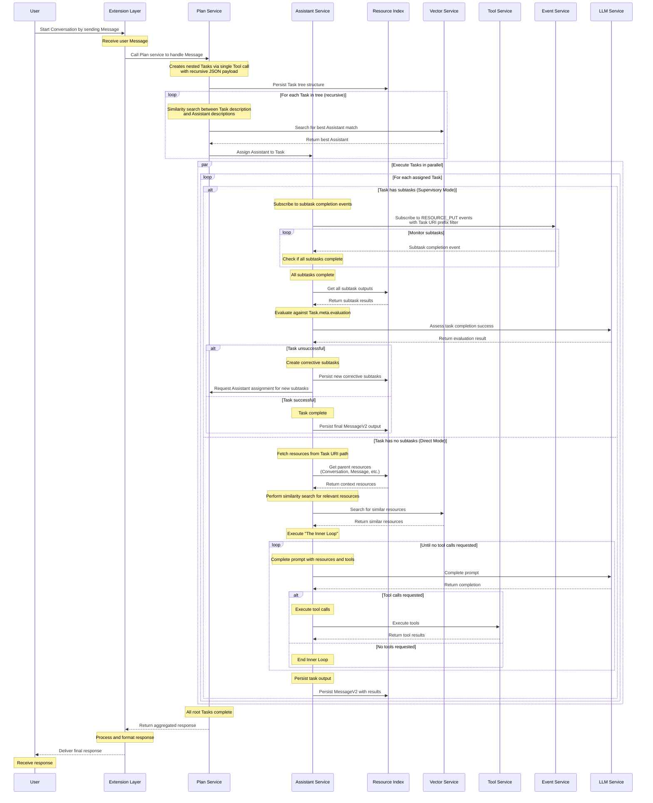

# TODO

**Goal:** Enable multiple agents, coordinated by a planner, with nested tasks
and policies for robust workflow controls.

## Implementation Roadmap

### Phase 1: Foundation (Steps 1-4)

- [x] **Step 01**: Deprecate History, Agent, Text services
- [x] **Step 02**: Remove `libchunk`, `libprompt`
- [x] **Step 03**: Deprecate some protobuf types
- [x] **Step 04**: Enhancing `libstorage`

### Phase 2: Core Resources (Steps 5-7)

- [x] **Step 05**: New `libpolicy`
- [x] **Step 06**: New `Resource` type and `libresource`
- [x] **Step 07**: Use `Resource` type and `libresource`

### Phase 3: Services & Integration (Steps 8-9+)

- [x] **Step 08**: New Memory service
- [x] **Step 09**: Rename tools to scripts
- [ ] **Step 10**: New Tool service
- [ ] **Step 11**: New Event service
- [ ] **Step 12**: New Plan service
- [ ] **Step 13**: New Assistant service
- [ ] **Step 14**: Update extensions to use Plan service
- [ ] **Step 15**: Remove deprecated items and rename `MessageV2` to `Message`
- [ ] **Step 16**: New Graph tool

**🚨 CRITICAL**: Each step must be completed and tested before proceeding to the
next step. Dependencies between steps are strict and must be respected.

## Summary

The architecture is shifting towards a more flexible concept around generic
resources. Anything that an agent needs to achieve its goal is considered a
resource. For example: conversations, messages, tasks, and text chunks. Even
other agents are considered resources!

Tasks are broken down into infinitely nested subtasks for flexible workflow
execution. Tasks are executed recursively with Assistants assigned based on
similarity between their capabilities and task requirements.

Access to resources is managed by policies that are defined in `.rego` files and
evaluated using the `@openpolicyagent/opa-wasm` library.

### Resources vs. Linked Data

There will be a distinction between _Resources_ and _Linked Data_.

**Linked Data** describes the relationships between pieces of information
contained inside text chunks. **Resources** are the text chunks themselves, _not
the data inside them_.

Resources are managed by the `Resource` service, backed by a simple undirected
tree. Resources are critical to the functioning of the system itself.

Linked Data and the `Graph` service are not critical to the system's core
functionality. They only support Tools that improve the accuracy of the agents.

The `Graph` service is backed by an in-memory RDF graph using the `n3` package.
That is, the `Graph` service manages Linked Data in a directed graph.

### Resources and Policies

Resources are identified by a simple Universal Resource Identifier (URI)
formatted as `uri_namespace:path` where:

- `uri_namespace` is the URI assignment and always set to "cld"
- `path` is parents' path plus the resource's own path element, joined by "/"
- Each path element consist of a resource type and ID joined by "."

Resources are stored using their URI as the object name. Here are examples
looking at the raw local file system:

```bash
developer@localhost$ ls -1 resources/
cld:common.Conversation.hash0001.json
cld:common.Conversation.hash0001/common.MessageV2.hash0002.json
cld:common.Conversation.hash0001/common.MessageV2.hash0002/plan.Task.hash0003.json
cld:common.Conversation.hash0001/common.MessageV2.hash0002/plan.Task.hash0003/plan.Task.hash0004.json
```

It is now fast and efficient for the Resource service to fetch all tasks within
a conversation or all subtasks within a task by searching for objects with the
appropriate URI prefix.

### Current State

**The current architecture** is documented in
[docs/architecture.html](docs/architecture.html).

### Future State

#### Simple Summary

1. **Users**
   1. Start a Conversation by sending a Message to Extensions
2. **Extensions**
   1. Receive user Message
   1. Call Plan service to handle the Message
3. **Plan service**
   1. Creates one or more nested Tasks using a single Tool call
   2. Each Task is assigned an Assistant based on similarity search
4. **Assistant service**
   1. For Tasks with subtasks: subscribes to Events and monitors completion
   2. For Tasks without subtasks: executes the Inner Loop directly
   3. Evaluates task completion and creates corrective subtasks if needed
5. **Plan service**
   1. Responds to Extensions when all Tasks complete
6. **Extensions**
   1. Respond to User
7. **Users**
   1. Receive the response

#### Task System Architecture

**Task Creation and Nesting**

Tasks are created by the Plan service through a single Tool call with a
recursive JSON payload. Tasks can be infinitely nested, forming a tree structure
where each subtask can have its own subtasks.

**Resource Metadata Enhancement**

All resources (Tasks, Assistants, etc.) have enhanced metadata under their
"Resource meta" data with four key properties:

1. **purpose** - What the resource is meant to accomplish
2. **instructions** - How to execute or work with the resource
3. **applicability** - When or when not to use the resource
4. **evaluation** - What successful execution looks like

These four properties are compiled into a single structured "description" of the
resource, which is used for vector embedding and similarity searches.

**Assistant Assignment**

For each Task recursively, an Assistant is elected through similarity search
between the Assistant's description and the Task's description (both compiled
from the four metadata properties above).

**Task Execution Patterns**

Tasks are executed in one of two modes:

- **Supervisory Mode** (Tasks with subtasks): Assistant subscribes to Events and
  monitors subtask completion
- **Direct Mode** (Tasks without subtasks): Assistant executes the Inner Loop
  directly

#### Task Execution: Supervisory Mode

When a Task has subtasks, the assigned Assistant operates in supervisory mode:

1. Subscribes to completion events for all subtasks
2. Monitors subtask completion and evaluates against `Task.meta.evaluation`
3. Creates corrective subtasks if the overall task was unsuccessful

#### Task Execution: Direct Mode

When a Task has no subtasks, the assigned Assistant executes directly:

1. Fetches related resources and performs similarity search for context
2. Executes "The Inner Loop" (defined below)
3. Persists a `MessageV2` resource with the task output

#### The Inner Loop

The Inner Loop remains unchanged from the previous architecture and consists of
iterative prompt completion with tool execution until no more tools are
requested.

The URI structure enables easy fetching of all parent resources. For example, a
sub Task URI like
`cld:common.Conversation.hash0001/common.MessageV2.hash0002/plan.Task.hash0003/plan.Task.hash0004`
allows the Assistant to fetch the Conversation, Message, and parent Task
contexts.

#### Detailed Sequence Diagram



## Implementation Plan

### Step 10: New Tool Service

**🎯 Objective**: Create an extensible `Tool` service that acts as a gRPC proxy
between tool calls requested by `LLMs` and actual tool implementations, with
automatic tool discovery and registration from `./tools/*.proto` files.

**🔧 Implementation Details:**

1. **Tool Configuration**: Tools are defined in `service.tool.endpoints`
   configuration, mapping to existing or new gRPC service methods
2. **Proxy Architecture**: Tool service routes tool calls to appropriate gRPC
   endpoints based on service mappings in configuration
3. **Auto-Registration**: Tool schemas are generated from configuration and
   stored as resources for LLM consumption
4. **Dynamic Routing**: Tool service uses `hostname`/port mappings from
   `config.yml` (accessed via `ServiceConfig`) to route calls to service
   implementations
5. **Extensible Design**: New tools can be added by updating configuration to
   map to existing service methods or by creating new services
6. **Optional `Proto` Files**: Tools can optionally have `.proto` files in
   `./tools/` directory for new services, but existing services can be mapped
   directly

**📋 Detailed Tasks**:

#### Task 1: Create Tool Configuration Infrastructure

- [ ] Create `tools/` directory structure in project root (optional for new
      tools)
- [ ] Create sample tool proto `tools/hash_tools.proto` (for new custom tools):

  ```proto
  syntax = "proto3";

  package toolbox;

  service HashTools {
    rpc Sha256Hash(HashRequest) returns (HashResponse);
    rpc Md5Hash(HashRequest) returns (HashResponse);
  }

  message HashRequest {
    string input = 1;
  }

  message HashResponse {
    string hash = 1;
    string algorithm = 2;
  }
  ```

- [ ] Update `.gitignore` if needed to track `tools/` directory
- [ ] Create `tools/README.md` explaining that tools can be mapped to existing
      services or defined as new services
- [ ] Note: Vector search tool will map to existing `vector.QueryItems` - no
      proto file needed

#### Task 2: Extend Type Generation for Tool `Protobuf` Files

- [ ] Modify `scripts/codegen.js --type` to include `./tools/*.proto` files:
  - Update `runTypeGeneration()` function to scan `./tools/*.proto` files
  - Include tool `proto` files in `protobufjs` compilation alongside existing
    `proto` files
  - Generate TypeScript definitions for tool message types in
    `@copilot-ld/libtype`
  - Ensure tool protobuf types are available for schema generation and service
    usage
- [ ] Test type generation includes tool definitions:
  - Verify `toolbox.HashRequest` and `toolbox.HashResponse` types are generated
  - Confirm tool types are exported from `@copilot-ld/libtype`

#### Task 3: Define Tool Service Protocol

- [ ] Create `proto/tool.proto` with proxy service definition:

  ```proto
  syntax = "proto3";

  import "common.proto";

  package tool;

  service Tool {
    rpc ExecuteTool(common.Tool) returns (common.ToolCallResult);
    rpc ListTools(ListToolsRequest) returns (ListToolsResponse);
  }

  message ListToolsRequest {
    optional string namespace = 1;
  }

  message ListToolsResponse {
    repeated common.Tool tools = 1;
  }
  ```

- [ ] Run `npm run codegen` to generate service base and client
- [ ] Verify generated files in `services/tool/` directory

#### Task 4: Implement Tool Service Foundation

- [ ] Create `services/tool/` directory structure:
  - `services/tool/index.js` - Main `ToolService` implementation
  - `services/tool/package.json` - Service dependencies
  - `services/tool/Dockerfile` - Container definition
  - `services/tool/CHANGELOG.md` - Component changelog
- [ ] Implement `ToolService` extending `ToolBase`:
  - Constructor accepts `ServiceConfig` following established patterns
  - Access tool endpoint mappings via `this.config.endpoints` from loaded config
  - Load available tools from `ResourceIndex` during initialization
  - Create gRPC client connections to tool services based on config mapping
  - Implement policy integration for tool access control

#### Task 5: Implement Proxy Logic

- [ ] Implement `ExecuteTool` method in `ToolService`:
  - Parse tool function name to determine target service
  - Look up service endpoint from configuration mapping
  - Convert `common.Tool` request to appropriate protobuf message
  - Create gRPC client connection to target service
  - Forward request and convert response back to `common.ToolCallResult`
  - Add comprehensive error handling and logging
  - **Example routing logic**:
    - `search_similar_content` →
      `VectorClient.QueryItems(vector.QueryItemsRequest)`
    - `calculate_sha256` → `HashToolsClient.Sha256Hash(toolbox.HashRequest)`
- [ ] Implement `ListTools` method:
  - Query `ResourceIndex` for available tool schemas
  - Return formatted tool definitions for LLM consumption
  - Support namespace filtering for tool organization
- [ ] Add connection pooling for tool service gRPC clients

#### Task 6: Tool Configuration and Mapping

- [ ] Define tool service configuration in `config/config.example.yml`:
  ```yaml
  service:
    tool:
      endpoints:
        # Example 1: Mapping to existing service method
        vector_search:
          call: "vector.Vector.QueryItems"
          name: "search_similar_content"
          description: "Search for similar content using vector embeddings"
        # Example 2: New custom tool service
        sha256_hash:
          call: "toolbox.HashTools.Sha256Hash"
          name: "calculate_sha256"
          description: "Calculate SHA-256 hash of input text"
        # Additional tool endpoints can map to existing or new services...
  ```
- [ ] Tool service accesses endpoint mappings via `this.config.endpoints`
- [ ] Each tool mapping includes service details and user-facing metadata
- [ ] Create validation for tool configuration completeness in tool service
- [ ] Environment variable overrides work through existing `ServiceConfig`
      patterns

#### Task 7: Create Tool Schema Resource Generator

- [ ] Create `scripts/tools.js` following the pattern of `scripts/resources.js`:
  - Accept command line arguments for tool schema generation options
  - Use `ScriptConfig.create("tools")` for configuration
  - Initialize `ResourceIndex`, storage factories, and logging
  - Read tool configuration from `config.yml` `service.tool.endpoints` section
- [ ] Implement OpenAI-compatible JSON schema generation:
  - Read tool endpoint mappings from configuration
  - Generate JSON schemas for mapped services using existing `protobuf` types
    (e.g., `vector.QueryItemsRequest`)
  - Generate JSON schemas for custom toolbox services using generated `protobuf`
    types (e.g., `toolbox.HashRequest`)
  - Map `protobuf` types to JSON schema types (string, number, boolean, etc.)
  - Generate required/optional field arrays from `protobuf` field definitions
  - Create tool descriptions from configuration metadata
- [ ] Store generated schemas as resources using `ResourceIndex`:
  - Create resource entries for each tool schema
  - Use proper resource URIs for tool schema identification
  - Include tool metadata (description, parameters, examples) from configuration
  - No code generation - only JSON schema creation and resource storage
- [ ] Add resource querying support for dynamic tool discovery in `ToolService`

#### Task 8: Sample Tool Implementation (Optional)

- [ ] **Example 1: Map to existing service** - Vector search tool:
  - Configure tool mapping in `service.tool.endpoints` to point to
    `vector.QueryItems`
  - Generate tool schema based on `vector.QueryItemsRequest` `protobuf`
    definition
  - Test tool execution by proxying calls to existing vector service
  - No additional implementation required - pure configuration mapping
- [ ] **Example 2: Create new custom service** - Hash tools:
  - Create `tools/hash-tools/index.js` implementing `toolbox.HashTools` service
  - Implement `Sha256Hash` method accepting `HashRequest` and returning
    `HashResponse`
  - Add to Docker configuration and service discovery
  - Test custom tool execution through proxy
- [ ] Verify both mapping approaches work:
  - Existing service mapping (vector search - primary approach)
  - Custom tool service (hash tools - for new functionality)

#### Task 9: Docker and Development Integration

- [ ] Add `tool` service to `docker-compose.yml`:
  ```yaml
  tool:
    build:
      context: .
      dockerfile: ./services/tool/Dockerfile
    image: copilot-ld/tool:latest
    container_name: copilot-ld.tool
    env_file: ./config/.env
    networks:
      - internal
  ```
- [ ] Update `scripts/dev.js` to include tool service
- [ ] Verify service startup and tool discovery functionality
- [ ] Test tool execution with mapped vector search functionality

#### Task 10: Agent Integration

- [ ] Add `ToolClient` dependency to `AgentService`:
  - Update constructor with proper dependency injection
  - Add tool client validation and initialization
  - Update `services/agent/server.js` to create `ToolClient` instance
- [ ] Implement tool call execution in `AgentService.ProcessRequest`:
  - Detect tool calls in LLM responses
  - Execute tools via `ToolClient.ExecuteTool` calls
  - Handle tool results and format for LLM continuation
  - Add error handling for tool execution failures
- [ ] Implement basic Inner Loop with tool calling support

#### Task 11: Testing and Validation

- [ ] Create comprehensive test suite `test/tool-service.test.js`:
  - Test tool schema generation from configuration via `scripts/tools.js`
  - Test tool proxy execution with both examples:
    - Vector search mapping to `vector.QueryItems`
    - Hash tools mapping to `toolbox.HashTools.Sha256Hash`
  - Test error handling for missing tools and invalid requests
  - Test policy enforcement and access control
- [ ] Create integration tests for end-to-end tool calling
- [ ] Test tool configuration loading and endpoint mapping
- [ ] Validate OpenAI schema generation accuracy for both mapped and custom
      tools
- [ ] Test routing logic handles both existing service methods and new custom
      services

#### Task 12: Documentation Updates

- [ ] Update `services/tool/CHANGELOG.md` with implementation details
- [ ] Add tool service to `docs/architecture.html`:
  ```html
  <h4>Tool Service</h4>
  <p>
    <strong>Purpose</strong>: Acts as a gRPC proxy between LLM tool calls and
    actual tool implementations, with automatic discovery from tools/*.proto
  </p>
  <p><strong>Key Operations</strong>:</p>
  <ul>
    <li>
      <code>ExecuteTool</code>: Proxies tool calls to appropriate services
    </li>
    <li><code>ListTools</code>: Returns available tools for LLM consumption</li>
  </ul>
  ```
- [ ] Create `tools/README.md` explaining that tools can be mapped to existing
      services or implemented as new services
- [ ] Update main `README.md` with tool development workflow

**✅ Success Criteria**:

1. **Tool Configuration**: Tools can be defined via configuration mapping to
   existing services
2. **Type Generation**: Tool `protobuf` types included in `@copilot-ld/libtype`
   via modified `scripts/codegen.js --type`
3. **Schema Generation**: OpenAI-compatible JSON schemas generated by
   `scripts/tools.js` from config.yml endpoint definitions and stored as
   resources
4. **Proxy Functionality**: Tool service successfully routes calls to target
   services (existing or new)
5. **Configuration Flexibility**: Tools can map to existing service methods
   (like `vector.QueryItems`) or new custom services
6. **Extensibility**: New tools can be added by configuration mapping or
   optional proto file creation with type generation
7. **Agent Integration**: Agent service can discover and execute tools via proxy
8. **Testing**: Comprehensive test coverage for both mapping approaches

**🔗 Dependencies**:

- Current protobuf types in `common.proto` (already contain `Tool` and
  `ToolCallResult`)
- Existing `@copilot-ld/libpolicy` for access control
- Existing `ResourceIndex` for tool schema storage
- Existing service patterns and Docker infrastructure
- Modified `scripts/codegen.js --type` for tool protobuf type generation
- New `scripts/tools.js` for JSON schema generation and resource storage from
  config.yml

**🚧 Implementation Notes**:

- Tool service acts as a pure proxy - no business logic, just routing
- Tools can be mapped to existing service methods or implemented as new services
- Configuration-driven endpoint mapping allows flexible deployment
- Resource-based tool schemas enable dynamic tool discovery via
  `scripts/tools.js`
- Follows existing architectural patterns for consistency
- Extensible design supports both service mapping and custom tool development
- Primary approach is mapping to existing services; custom tools optional for
  complex new functionality
- `scripts/codegen.js --type` only handles low-level protobuf type generation
- `scripts/tools.js` only generates JSON schemas and saves resources, no code
  generation

**Generated Tool Schema Examples**:

Example 1 - Existing service mapping (`vector.QueryItems`):

```json
{
  "type": "function",
  "function": {
    "name": "search_similar_content",
    "description": "Search for similar content using vector embeddings",
    "parameters": {
      "type": "object",
      "properties": {
        "vector": {
          "type": "array",
          "items": { "type": "number" },
          "description": "Query vector for similarity search"
        },
        "filter": {
          "type": "object",
          "properties": {
            "threshold": { "type": "number" },
            "limit": { "type": "integer" }
          }
        }
      },
      "required": ["vector"]
    }
  }
}
```

Example 2 - Custom service (`toolbox.HashTools.Sha256Hash`):

```json
{
  "type": "function",
  "function": {
    "name": "calculate_sha256",
    "description": "Calculate SHA-256 hash of input text",
    "parameters": {
      "type": "object",
      "properties": {
        "input": {
          "type": "string",
          "description": "Text to hash"
        }
      },
      "required": ["input"]
    }
  }
}
```

## Step 11: New Event service

**🎯 Objective**: TODO

**📋 Tasks**:

TODO

**🔧 Implementation Details**:

The `event.proto` definitions are added:

```proto
syntax = "proto3";

import "common.proto";

package event;

service Event {
  rpc Publish(Event) returns (PublishResponse);
  rpc Subscribe(SubscribeRequest) returns (stream Event);
}

enum DetailType {
  RESOURCE_PUT = 0;
  RESOURCE_GET = 1;
  RESOURCE_DELETE = 2;
}

message Event {
  string id = 1; // UUID
  string source = 2;
  string time = 3; // ISO 8601
  repeated Resource resources = 4;
  DetailType detail_type = 5;
}

message PublishResponse {
  bool success = 1;
  string id = 2;
}

message SubscribeRequest {
  repeated string sources = 1;
  repeated string detail_types = 2;
}
```

**✅ Success Criteria**:

TODO

### Steps 12-16: Other Service Implementations & Integrations

**🎯 Objective**: Implement other new services and complete the architectural
transition.

**📋 Tasks**:

- **Step 12**: New Plan service
- **Step 13**: New Assistant service
- **Step 14**: Update extensions to use Plan service
- **Step 15**: Remove deprecated items and rename `MessageV2` to `Message`
- **Step 16**: New Graph tool

**⚠️ Implementation Notes**:

- Each step builds on previous completed steps
- Services must follow established gRPC patterns from existing codebase
- All new services require comprehensive unit and integration tests
- Performance benchmarks must be established for each service
- Documentation must be updated incrementally with each service addition

**🔧 Implementation Details**:

The `plan.proto` definitions are added:

```proto
syntax = "proto3";

import "common.proto";

package plan;

service Plan {
  rpc Process(common.MessageV2) returns (stream common.MessageV2);
}

message Task {
  common.Resource meta = 1;
  repeated Task subtasks = 2;
  optional string assistant = 3; // Resource ID of assigned Assistant
  optional bool completed = 4;
  optional string completed_at = 5; // ISO 8601
}
```

**✅ Success Criteria for Each Step**:

- Service implements all protobuf-defined methods
- gRPC integration works with existing infrastructure
- Unit tests achieve >90% coverage
- Integration tests validate end-to-end functionality
- Performance meets or exceeds current system benchmarks
- Documentation reflects new capabilities
