# TODO

**Goal:** Enable multiple agents, coordinated by a planner, with nested tasks
and policies for robust workflow controls.

## Implementation Roadmap

### Phase 1: Foundation (Steps 1-4)

- [x] **Step 01**: Deprecate History, Agent, Text services
- [x] **Step 02**: Remove `libchunk`, `libprompt`
- [x] **Step 03**: Deprecate some protobuf types
- [x] **Step 04**: Enhancing `libstorage`

### Phase 2: Core Resources (Steps 5-7)

- [x] **Step 05**: New `libpolicy`
- [x] **Step 06**: New `Resource` type and `libresource`
- [x] **Step 07**: Use `Resource` type and `libresource`

### Phase 3: Services & Integration (Steps 8-9+)

- [x] **Step 08**: New Memory service
- [x] **Step 09**: Rename tools to scripts
- [ ] **Step 10**: New Tool service
- [ ] **Step 11**: New Event service
- [ ] **Step 12**: New Plan service
- [ ] **Step 13**: New Assistant service
- [ ] **Step 14**: Update extensions to use Plan service
- [ ] **Step 15**: Remove deprecated items and rename `MessageV2` to `Message`
- [ ] **Step 16**: New Graph tool

**🚨 CRITICAL**: Each step must be completed and tested before proceeding to the
next step. Dependencies between steps are strict and must be respected.

## Summary

The architecture is shifting towards a more flexible concept around generic
resources. Anything that an agent needs to achieve its goal is considered a
resource. For example: conversations, messages, tasks, and text chunks. Even
other agents are considered resources!

Tasks are broken down into infinitely nested subtasks for flexible workflow
execution. Tasks are executed recursively with Assistants assigned based on
similarity between their capabilities and task requirements.

Access to resources is managed by policies that are defined in `.rego` files and
evaluated using the `@openpolicyagent/opa-wasm` library.

### Resources vs. Linked Data

There will be a distinction between _Resources_ and _Linked Data_.

**Linked Data** describes the relationships between pieces of information
contained inside text chunks. **Resources** are the text chunks themselves, _not
the data inside them_.

Resources are managed by the `Resource` service, backed by a simple undirected
tree. Resources are critical to the functioning of the system itself.

Linked Data and the `Graph` service are not critical to the system's core
functionality. They only support Tools that improve the accuracy of the agents.

The `Graph` service is backed by an in-memory RDF graph using the `n3` package.
That is, the `Graph` service manages Linked Data in a directed graph.

### Resources and Policies

Resources are identified by a simple Universal Resource Identifier (URI)
formatted as `uri_namespace:path` where:

- `uri_namespace` is the URI assignment and always set to "cld"
- `path` is parents' path plus the resource's own path element, joined by "/"
- Each path element consist of a resource type and ID joined by "."

Resources are stored using their URI as the object name. Here are examples
looking at the raw local file system:

```bash
developer@localhost$ ls -1 resources/
cld:common.Conversation.hash0001.json
cld:common.Conversation.hash0001/common.MessageV2.hash0002.json
cld:common.Conversation.hash0001/common.MessageV2.hash0002/plan.Task.hash0003.json
cld:common.Conversation.hash0001/common.MessageV2.hash0002/plan.Task.hash0003/plan.Task.hash0004.json
```

It is now fast and efficient for the Resource service to fetch all tasks within
a conversation or all subtasks within a task by searching for objects with the
appropriate URI prefix.

### Current State

**The current architecture** is documented in
[docs/architecture.html](docs/architecture.html).

### Future State

#### Simple Summary

1. **Users**
   1. Start a Conversation by sending a Message to Extensions
2. **Extensions**
   1. Receive user Message
   1. Call Plan service to handle the Message
3. **Plan service**
   1. Creates one or more nested Tasks using a single Tool call
   2. Each Task is assigned an Assistant based on similarity search
4. **Assistant service**
   1. For Tasks with subtasks: subscribes to Events and monitors completion
   2. For Tasks without subtasks: executes the Inner Loop directly
   3. Evaluates task completion and creates corrective subtasks if needed
5. **Plan service**
   1. Responds to Extensions when all Tasks complete
6. **Extensions**
   1. Respond to User
7. **Users**
   1. Receive the response

#### Task System Architecture

**Task Creation and Nesting**

Tasks are created by the Plan service through a single Tool call with a
recursive JSON payload. Tasks can be infinitely nested, forming a tree structure
where each subtask can have its own subtasks.

**Resource Metadata Enhancement**

All resources (Tasks, Assistants, etc.) have enhanced metadata under their
"Resource meta" data with four key properties:

1. **purpose** - What the resource is meant to accomplish
2. **instructions** - How to execute or work with the resource
3. **applicability** - When or when not to use the resource
4. **evaluation** - What successful execution looks like

These four properties are compiled into a single structured "description" of the
resource, which is used for vector embedding and similarity searches.

**Assistant Assignment**

For each Task recursively, an Assistant is elected through similarity search
between the Assistant's description and the Task's description (both compiled
from the four metadata properties above).

**Task Execution Patterns**

Tasks are executed in one of two modes:

- **Supervisory Mode** (Tasks with subtasks): Assistant subscribes to Events and
  monitors subtask completion
- **Direct Mode** (Tasks without subtasks): Assistant executes the Inner Loop
  directly

#### Task Execution: Supervisory Mode

When a Task has subtasks, the assigned Assistant operates in supervisory mode:

1. Subscribes to completion events for all subtasks
2. Monitors subtask completion and evaluates against `Task.meta.evaluation`
3. Creates corrective subtasks if the overall task was unsuccessful

#### Task Execution: Direct Mode

When a Task has no subtasks, the assigned Assistant executes directly:

1. Fetches related resources and performs similarity search for context
2. Executes "The Inner Loop" (defined below)
3. Persists a `MessageV2` resource with the task output

#### The Inner Loop

The Inner Loop remains unchanged from the previous architecture and consists of
iterative prompt completion with tool execution until no more tools are
requested.

The URI structure enables easy fetching of all parent resources. For example, a
sub Task URI like
`cld:common.Conversation.hash0001/common.MessageV2.hash0002/plan.Task.hash0003/plan.Task.hash0004`
allows the Assistant to fetch the Conversation, Message, and parent Task
contexts.

#### Detailed Sequence Diagram

```mermaid
sequenceDiagram
    participant User
    participant Extension as Extension Layer
    participant Plan as Plan Service
    participant Asst as Assistant Service
    participant Resource as Resource Index
    participant Vector as Vector Service
    participant Tools as Tool Service
    participant Event as Event Service
    participant LLM as LLM Service

    %% Step 1: Users start conversation
    User->>Extension: Start Conversation by sending Message

    %% Step 2: Extensions receive and forward
    Note over Extension: Receive user Message
    Extension->>Plan: Call Plan service to handle Message

    %% Step 3: Plan service creates nested Tasks
    Note over Plan: Creates nested Tasks via single Tool call<br/>with recursive JSON payload
    Plan->>Resource: Persist Task tree structure

    %% Step 4: Assign Assistants to Tasks
    loop For each Task in tree (recursive)
        Note over Plan: Similarity search between Task description<br/>and Assistant descriptions
        Plan->>Vector: Search for best Assistant match
        Vector-->>Plan: Return best Assistant
        Plan->>Asst: Assign Assistant to Task
    end

    %% Step 5: Task Execution
    par Execute Tasks in parallel
        loop For each assigned Task
            alt Task has subtasks (Supervisory Mode)
                Note over Asst: Subscribe to subtask completion events
                Asst->>Event: Subscribe to RESOURCE_PUT events<br/>with Task URI prefix filter

                loop Monitor subtasks
                    Event-->>Asst: Subtask completion event
                    Note over Asst: Check if all subtasks complete
                end

                Note over Asst: All subtasks complete
                Asst->>Resource: Get all subtask outputs
                Resource-->>Asst: Return subtask results

                Note over Asst: Evaluate against Task.meta.evaluation
                Asst->>LLM: Assess task completion success
                LLM-->>Asst: Return evaluation result

                alt Task unsuccessful
                    Note over Asst: Create corrective subtasks
                    Asst->>Resource: Persist new corrective subtasks
                    Asst->>Plan: Request Assistant assignment for new subtasks
                else Task successful
                    Note over Asst: Task complete
                    Asst->>Resource: Persist final MessageV2 output
                end

            else Task has no subtasks (Direct Mode)
                %% Fetch task context
                Note over Asst: Fetch resources from Task URI path
                Asst->>Resource: Get parent resources<br/>(Conversation, Message, etc.)
                Resource-->>Asst: Return context resources

                %% Similarity search for additional context
                Note over Asst: Perform similarity search for relevant resources
                Asst->>Vector: Search for similar resources
                Vector-->>Asst: Return similar resources

                %% The Inner Loop
                Note over Asst: Execute "The Inner Loop"
                loop Until no tool calls requested
                    Note over Asst: Complete prompt with resources and tools
                    Asst->>LLM: Complete prompt
                    LLM-->>Asst: Return completion

                    alt Tool calls requested
                        Note over Asst: Execute tool calls
                        Asst->>Tools: Execute tools
                        Tools-->>Asst: Return tool results
                    else No tools requested
                        Note over Asst: End Inner Loop
                    end
                end

                Note over Asst: Persist task output
                Asst->>Resource: Persist MessageV2 with results
            end
        end
    end

    %% Step 6: Plan service responds when all complete
    Note over Plan: All root Tasks complete
    Plan-->>Extension: Return aggregated response

    %% Step 7: Extensions respond to User
    Note over Extension: Process and format response
    Extension-->>User: Deliver final response
    Note over User: Receive response
```



## Implementation Plan

### Step 09: Rename tools to scripts

**🎯 Objective:** Rename tools to scripts in order to not collide with the
upcoming implementation of AI tools.

**🔧 Implementation Details:**

- DO rename all instances of "tool" to "script"
- DO NOT rename the protobuf Tool type
- DO NOT reference the previous state of tools
- DO ONLY reference the new state

**📋 Tasks**:

- Rename the directory `./tools` to `./scripts`
- Update classes, variables, logging namespaces to reference "script" instead of
  "tool"
- Update all documentation, including but not limited to `README.md`,
  `getting-started.html` and `architecture.html`
- Update all instructions in `.github/instructions`

**✅ Success Criteria**:

- The ONLY reference to "tool" in the ENTIRE codebase should be the existing
  protobuf Tool types

### Step 10: New Tool Service

**🎯 Objective**: Each tool should be a standardized gRPC call. Define a simple
interface, and implement the first tool which is a vector search tool.

**🔧 Implementation Details:**

- Tools calls are implemented as gRPC calls
- Tool resources with function parameter schema are code generated from protobuf
  files

**📋 Tasks**:

- Refine the protobuf types in `common.proto`
- Define the protobuf request and response types
- Provide a simple way to configure a map of tool names and host/port/method
- Provide a standard container in which tools run
- Define a separate Docker network in which tool containers run
- Implement a simple policy that manage access to tools
- Implement a vector search tool
- Implement a simple single-agent version of the "Inner Loop" with tool calls

**✅ Success Criteria**:

- Tools are provided to the LLM
- Tool calls are requested by the LLM
- Tool call results are returned
- The chain of tool calls work without errors
- A simple policy manage what actors can access a given tool

## Step 11: New Event service

**🎯 Objective**: TODO

**📋 Tasks**:

TODO

**🔧 Implementation Details**:

The `event.proto` definitions are added:

```proto
syntax = "proto3";

import "common.proto";

package event;

service Event {
  rpc Publish(Event) returns (PublishResponse);
  rpc Subscribe(SubscribeRequest) returns (stream Event);
}

enum DetailType {
  RESOURCE_PUT = 0;
  RESOURCE_GET = 1;
  RESOURCE_DELETE = 2;
}

message Event {
  string id = 1; // UUID
  string source = 2;
  string time = 3; // ISO 8601
  repeated Resource resources = 4;
  DetailType detail_type = 5;
}

message PublishResponse {
  bool success = 1;
  string id = 2;
}

message SubscribeRequest {
  repeated string sources = 1;
  repeated string detail_types = 2;
}
```

**✅ Success Criteria**:

TODO

### Steps 12-16: Other Service Implementations & Integrations

**🎯 Objective**: Implement other new services and complete the architectural
transition.

**📋 Tasks**:

- **Step 11**: New Plan service
- **Step 12**: New Assistant service
- **Step 13**: Update extensions to use Plan service
- **Step 14**: Remove deprecated items and rename `MessageV2` to `Message`
- **Step 15**: New Graph tool

**⚠️ Implementation Notes**:

- Each step builds on previous completed steps
- Services must follow established gRPC patterns from existing codebase
- All new services require comprehensive unit and integration tests
- Performance benchmarks must be established for each service
- Documentation must be updated incrementally with each service addition

**🔧 Implementation Details**:

The `plan.proto` definitions are added:

```proto
syntax = "proto3";

import "common.proto";

package plan;

service Plan {
  rpc Process(common.MessageV2) returns (stream common.MessageV2);
}

message Task {
  common.Resource meta = 1;
  repeated Task subtasks = 2;
  optional string assistant = 3; // Resource ID of assigned Assistant
  optional bool completed = 4;
  optional string completed_at = 5; // ISO 8601
}
```

**✅ Success Criteria for Each Step**:

- Service implements all protobuf-defined methods
- gRPC integration works with existing infrastructure
- Unit tests achieve >90% coverage
- Integration tests validate end-to-end functionality
- Performance meets or exceeds current system benchmarks
- Documentation reflects new capabilities
