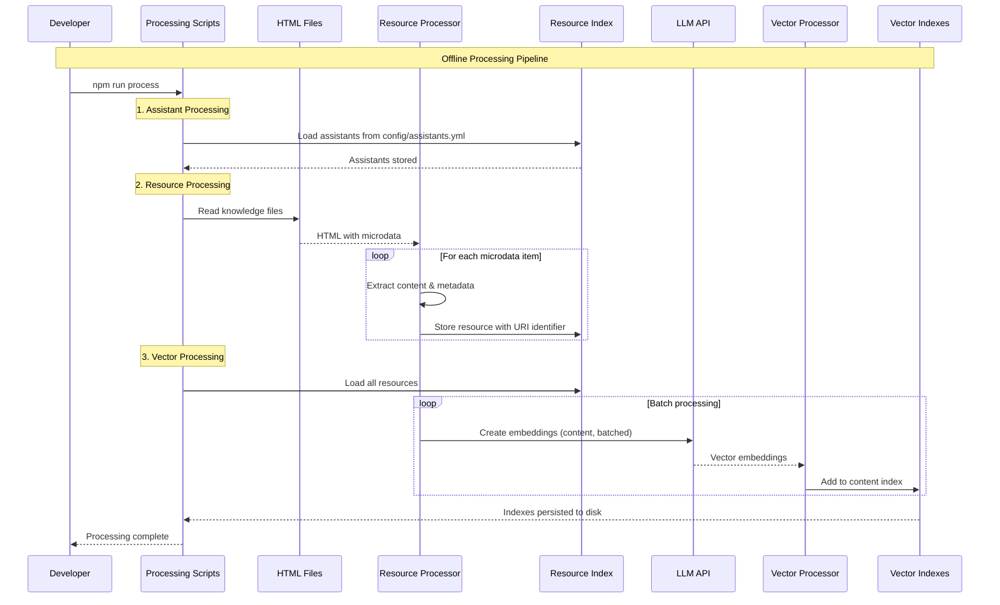
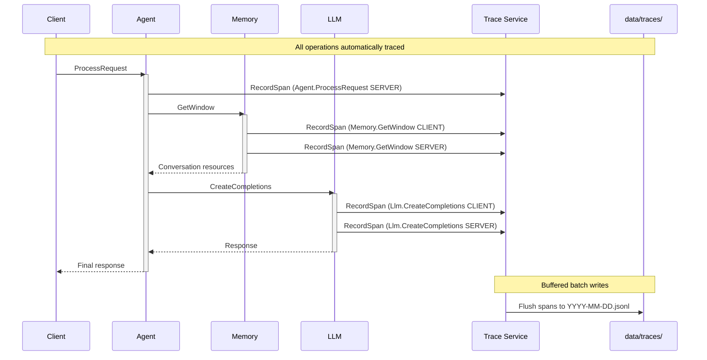

## High-Level Overview

The system is organized into three primary layers, each with distinct
responsibilities:

- **Extensions**: Application adapters that expose the platform through
  different interfaces (web UI, Teams bot, REST API)
- **Services**: Single-responsibility microservices communicating via gRPC with
  Protocol Buffers
- **Packages**: Reusable business logic libraries that services and extensions
  import

## Directory Structure

```text
copilot-ld/
├── services/            # gRPC microservices
│   ├── agent/           # Request orchestration
│   ├── memory/          # Conversation storage
│   ├── llm/             # Language model interface
│   ├── vector/          # Similarity search
│   ├── graph/           # Graph queries
│   └── tool/            # Tool execution proxy
├── extensions/          # Application adapters
│   ├── web/             # Web interface
│   └── teams/           # Teams bot (example)
├── packages/            # Business logic libraries
│   ├── libagent/        # Agent orchestration
│   ├── libmemory/       # Memory management
│   ├── libvector/       # Vector operations
│   ├── libgraph/        # Graph operations
│   ├── libresource/     # Resource management
│   ├── librpc/          # gRPC infrastructure
│   ├── libtype/         # Generated types
│   └── lib.../          # Additional utilities
├── proto/               # Protocol Buffer schemas
├── tools/               # Optional tool extensions
├── generated/           # Generated code artifacts
├── data/                # Runtime and processed data
└── scripts/             # Development utilities
```

## Component Relationships

### Communication Patterns

- **Client → Extension**: HTTP/HTTPS (REST endpoints)
- **Extension → Services**: gRPC with HMAC authentication
- **Service → Service**: gRPC with HMAC authentication
- **All Layers → Packages**: Direct imports (ES modules)

### Service Layer

Each service is a thin gRPC adapter around business logic packages. The Agent
service orchestrates requests by calling other services as needed:

- **Agent**: Orchestrates request processing and tool calling loops
- **Memory**: Manages conversation history with budget allocation
- **LLM**: Interfaces with language models for embeddings and completions
- **Vector**: Performs similarity search across dual indexes
- **Graph**: Executes pattern-based queries on RDF graphs
- **Tool**: Proxies tool calls from agent to implementations
- **Trace**: Collects distributed traces for observability

For detailed service implementations, see the [Reference Guide](/reference/).

### Package Layer

Business logic packages (`@copilot-ld/lib*`) contain framework-agnostic code
that services import. This separation enables:

- **Testability**: Unit test logic without service infrastructure
- **Reusability**: Same code powers services and CLI tools
- **Maintainability**: Clear separation between communication and computation

For complete package catalog, see the [Reference Guide](/reference/).

### Extension Layer

Extensions are application-specific adapters that call the Agent service via
gRPC. They handle:

- **Protocol Translation**: Convert HTTP/WebSocket/Bot protocols to gRPC
- **Authentication**: Validate user credentials and manage sessions
- **Input Validation**: Sanitize and validate user input
- **Rate Limiting**: Protect backend from abuse

## Online Request Flow

The following sequence diagram shows how a user request flows through the system
at runtime. The Agent makes autonomous decisions about which services to call
and when:


### Key Characteristics

- **Sequential per request**: Each request is processed step-by-step
- **Concurrent requests**: Multiple requests can be handled in parallel
- **Autonomous decisions**: Agent decides which tools to call dynamically
- **Policy filtering**: All resource access respects access policies
- **Budget management**: Token budgets allocated across context components

## Offline Processing Flow

Before the system can answer questions, knowledge must be processed into
searchable formats. This happens offline during the build process:



### Processing Stages

1. **Assistant Configuration**: Load assistant definitions from YAML
2. **Resource Extraction**: Parse HTML microdata into individual resources
3. **Embedding Creation**: Convert content to vector embeddings
4. **Index Building**: Create content index for similarity search

For detailed processing workflows, see the [Processing Guide](/processing/).

## Code Generation Workflow

Protocol Buffer schemas in `proto/` and `tools/` are compiled into JavaScript
types and service infrastructure:

```
Developer defines schema → npm run codegen → Generated artifacts
                                              ↓
proto/agent.proto ──────────────────→ generated/types/types.js
proto/memory.proto                     generated/services/agent/service.js
tools/hash.proto                       generated/services/agent/client.js
                                       generated/proto/ (copied schemas)
```

Services automatically create symlinks at startup so packages can access
generated code via `@copilot-ld/libtype` and `@copilot-ld/librpc`.

For code generation details, see the [Reference Guide](/reference/).

## Deployment Architecture

The system can be deployed in multiple configurations depending on your needs:

### Local Development

All services run on localhost with individual ports:

```bash
npm run dev
```

Services available at:

- **Web Extension**: `http://localhost:3000/web/`
- **Agent**: `localhost:3001` (gRPC, internal)
- **Memory**: `localhost:3002` (gRPC, internal)
- **LLM**: `localhost:3003` (gRPC, internal)
- **Vector**: `localhost:3004` (gRPC, internal)
- **Graph**: `localhost:3005` (gRPC, internal)
- **Tool**: `localhost:3006` (gRPC, internal)

### Docker Compose

Services run in Docker network with internal communication. Only the web
extension is exposed externally, while backend services are isolated in the
Docker network:

```bash
docker-compose up
```

### Production (AWS/Cloud)

- **Load Balancer**: Application Load Balancer routes to extensions
- **Container Orchestration**: ECS/Kubernetes manages services
- **Network Isolation**: Backend services in private VPC
- **Service Discovery**: DNS-based service resolution

For deployment instructions, see the [Deployment Guide](/deployment/).

## Security Architecture

Security is built into every layer of the architecture:

### Network Isolation

- **External Access**: Only extensions exposed via load balancer
- **Internal Services**: Backend services not accessible from outside
- **gRPC Communication**: All inter-service calls require HMAC authentication

### Authentication

- **Service-to-Service**: HMAC signatures with time-limited tokens
- **GitHub Integration**: OAuth device flow for user authentication
- **API Keys**: LLM service uses API keys for external calls

### Access Control

- **Policy-Based**: All resource access filtered by policies
- **Conversation Scoping**: Users only access their own conversations
- **Tool Restrictions**: Tools can be restricted by configuration

For security implementation details, see the [Reference Guide](/reference/).

## Observability Architecture

The platform includes built-in distributed tracing to provide visibility into
system behavior across all microservices.

### Tracing Flow



### Tracing Components

- **libtelemetry**: Core tracing library with `Tracer` and `Span` classes
- **Trace Service**: Receives spans via gRPC and persists to JSONL files
- **Code Generation**: Automatic instrumentation in service bases and clients
- **AsyncLocalStorage**: Propagates trace context across async operations

### Key Features

- **Zero-touch**: All gRPC methods automatically create spans
- **Distributed context**: Trace IDs link related spans across services
- **Parent-child tracking**: Span relationships captured automatically
- **Buffered I/O**: Efficient batch writes to daily trace files
- **Error safety**: Tracing failures never break application flow

### Trace Data

Spans are stored in `data/traces/YYYY-MM-DD.jsonl` with one JSON object per
line:

```json
{
  "trace_id": "8c1675ebe7c638",
  "span_id": "efdbcc4e6a1a78",
  "parent_span_id": "",
  "name": "Agent.ProcessRequest",
  "kind": 0,
  "start_time_unix_nano": "1234567890123456789",
  "end_time_unix_nano": "1234567890234567890",
  "attributes": {
    "service.name": "agent",
    "rpc.service": "Agent",
    "rpc.method": "ProcessRequest"
  },
  "status": { "code": "OK" }
}
```

For detailed tracing implementation and analysis, see the
[Reference Guide](/reference/).

## Next Steps

Now that you understand the architecture, explore:

- [Concepts](/concepts/) – Learn about linked data, RAG, and the foundational
  concepts behind architectural decisions
- [Reference](/reference/) – Dive into service implementations, package APIs,
  code generation, and security details
